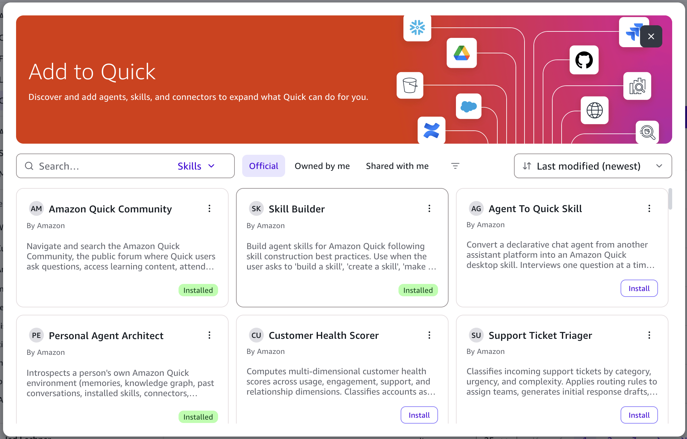

# Install a skill

You install skills from the catalog directly in Amazon Quick on desktop, so you don't need to download anything from this site.

## Prerequisites

You need Amazon Quick on desktop, installed and signed in. [Getting started](https://docs.aws.amazon.com/quick/latest/userguide/getting-started-desktop.html) in the Amazon Quick User Guide has the download links for macOS and Windows and the sign-in steps. If your organization uses an Enterprise account, an administrator has to set up sign-in before you download the application, as [Setting up Amazon Quick on desktop for enterprise deployments](https://docs.aws.amazon.com/quick/latest/userguide/desktop-enterprise-setup.html) describes.

## Find and install a skill

1. In Amazon Quick on desktop, choose **Customize > Skills**, and then choose **Browse all**.
1. In the **Add to Quick** window, choose the **Official** tab. It lists the same skills as the [skill catalog](skill-catalog.md) on this site.
1. Search for a skill by name, or filter by owner or category, and then choose a skill to preview it.
1. Choose **Install**. The skill's card then shows an **Installed** badge, as in Figure 1.
1. If the skill's README lists a connector, such as Outlook or Slack, find the connector on the **Connectors** tab under **Customize** and install it. Some cloud connectors don't appear there until they're added in Amazon Quick on the web, by you or by an administrator who shares them with you. After that, you can install them from the **Connectors** tab. For more information, see [Connectors](https://docs.aws.amazon.com/quick/latest/userguide/connections-desktop.html) in the Amazon Quick User Guide.

*Figure 1: The Official tab of the Add to Quick window*

## After you install a skill

A skill you install from the catalog is a reference to the published version, so it updates automatically when a new version is published, and you get fixes without installing it again. If you want to change a skill for your own work, duplicate it. The copy is a separate skill that you own and can edit. For more about managing your skills, see [Skills](https://docs.aws.amazon.com/quick/latest/userguide/skills-desktop.html) in the Amazon Quick User Guide.
