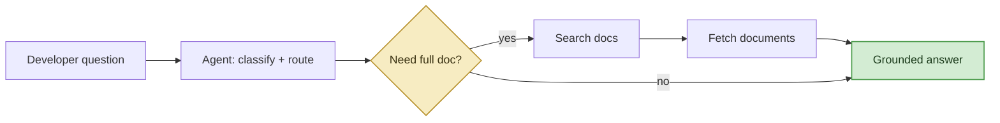
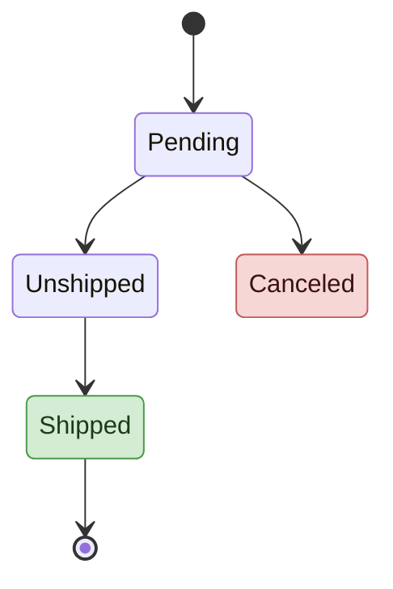

# Design, visualization, and code

How the skill turns SP-API questions into visuals, design proposals, and working code, always grounded in retrieved documentation.

## Visualization playbook (every response, rendered inline by the client)

The client renders mermaid blocks, tables, and code inline. Every turn pairs the text answer with at least one rendered visual. Pick the visual that fits the answer:

| Answer is about... | Visual to render |
|--------------------|------------------|
| An API call flow / "how X works" | mermaid sequence (client to SP-API calls) or flowchart |
| A status lifecycle (order, shipment, feed, report) | mermaid state diagram of documented transitions |
| Choosing between APIs / a comparison | a decision/comparison table (plus a small flow if a sequence is implied) |
| A data model / schema | mermaid ER or class diagram, or a highlighted-field table |
| A factual lookup | a compact table or a 2 to 3 node flow, still show something |
| A full design / brainstorm | the proposal artifact below |

Rule: diagrams are built only from what the docs state. Never add a state, transition, parameter, or connection that is not in retrieved content. An underspecified diagram beats a speculative one. Cite the docs the diagram is based on.

## Clean mermaid: minimal, accent-only styling (still fully inline)

Diagrams read best mostly clean with a few meaningful accents, not painted box-by-box. Leave ordinary nodes at the default style and add a soft accent color only to the nodes that carry special meaning: decision nodes, success end states, and error states. Everything stays inside the same fenced mermaid block.

The rule of thumb: default nodes plus up to three accent colors. Never use solid, saturated dark fills with white text.

Use these three soft accent classes, and only these:
- decision: the diamond branch/question nodes, a pale gold.
- done: a success or happy-path end state, a pale green.
- error: a failure, cancel, or not-found state, a pale red. Reserve red for that meaning only.

Leave every other node (callers, ordinary steps, API calls) unstyled.

### How to apply it: classDef plus class (flowchart, state, ER, class)
Define the accent classes once at the end of the block, then tag only the special nodes:

### Example: order lifecycle as a documented state diagram

(Only include the states and transitions the retrieved Orders docs actually define.)

### Sequence diagrams: leave them plain
Sequence diagrams do not take classDef. Write them plain; a clean default sequence diagram is exactly the intended look and renders reliably.

### Do-not-break rules (a styled block that fails to parse falls back to raw text)
The client renders a mermaid block only if it parses cleanly. Avoid these failure modes:
- Give classes plain descriptive names (decision, done, error). Never name a class call, click, end, class, graph, state, default, link, or href; these are reserved words and cause a hard parse error.
- Hex colors are exactly 6 digits (#f7ecc2), never 3-digit and never 8-digit with alpha. No rgba().
- Put classDef lines and class assignments at the very end, after all nodes and edges.
- When in doubt, ship the plain unstyled diagram; a clean default diagram is the target look anyway and always renders.

## The design-proposal artifact

When the developer is exploring an idea or asks for a design, produce one self-contained proposal artifact (the client renders it live and can update it as they iterate):
1. Problem / goal, one short paragraph in the developer's own terms.
2. Architecture diagram, mermaid graph of the proposed integration (their system to SP-API to notifications/reports).
3. Sequence / workflow diagram, the API call flow using real operationIds retrieved via the get-operation call.
4. Decision table, APIs / notifications / reports chosen, each with why (grounded in the use-case docs).
5. Optional charts, for example rollout phasing or a rate-limit/quota view, where the docs provide the numbers.
6. Sources, the exact docs the design is grounded in.

Iterate on the same artifact as the developer refines ("what if we add returns?") so the design visibly evolves. Every box, arrow, and row traces to a retrieved doc.

## Idea to code
1. Search the official SDK tutorial first: "Tutorial: Automate your SP-API Calls using a prebuilt <language> SDK". Supported languages: C#, Java, JavaScript, PHP, Python. Use the developer's stated language; otherwise default to JavaScript.
2. Only hand-write custom HTTP/REST when no official SDK covers the use case.
3. Base all code on retrieved documentation. Adapt for correctness (imports, syntax) but never invent endpoints, parameters, or auth patterns not shown in the docs.
4. Include auth/setup, error handling, and clear comments; favor completeness over brevity.
5. Pair the code with the workflow diagram so the developer sees flow plus implementation.

## Canonical official SP-API resources (cite when they add value)
- Developer Documentation: https://developer-docs.amazon.com/sp-api/
- Sample solutions (use cases): https://github.com/amzn/selling-partner-api-samples/tree/main/use-cases
- Schema / model repos: https://github.com/amzn/selling-partner-api-models
- Postman collections: https://www.postman.com/amazon-selling-partner-api/sp-api/overview
- SP-API University (video): https://www.youtube.com/@amazon-sp-api

Prefer the knowledge-base content (via the operations) as the primary source; use these official links as supplementary "learn more" references, always as descriptive links.
