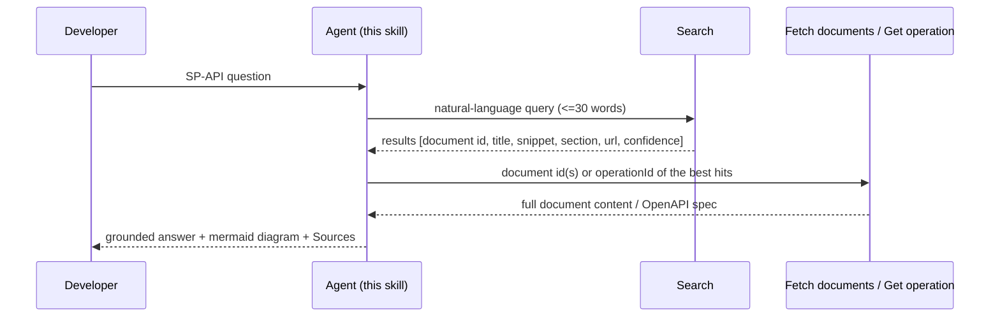

# Operation reference: SP-API knowledge operations

The skill uses four read-only knowledge operations exposed through the Amazon Selling Partner connector, backed by the SP-API documentation knowledge base (pinned to the active version).

## The two-step contract (search then fetch)

Search returns lightweight results for triage; a second call fetches full content. This keeps responses fast and grounded.

## Operations

### Search
- Input: a natural-language query (a well-formed question, not keyword fragments), under about 30 words. Optionally a section or type filter and pagination token.
- Returns: ranked results, each with a document id, title, snippet, section, url, and a confidence level (VERY_HIGH / HIGH / MEDIUM / LOW). Version-scoped to the active knowledge-base version automatically.
- Use as the entry point for almost every question. The document id it returns is what you pass to the fetch operation.

### Fetch documents
- Input: one or more document ids from search results.
- Returns: full document content (title, content, section, url, type, version) for each; any ids that do not resolve come back separately.
- Use to read the actual documentation behind the snippets before you answer.

### Browse section
- Input: a section name, optional page size and page token.
- Returns: the documents in that section as summaries, in display order, with a token when more pages exist.
- Use for onboarding, getting started, "what is in this area", and directory questions: browse the section to orient before fetching specific docs. Prefer this over an initial search for onboarding, registration, changelog, and directory lookups.

### Get operation
- Input: an operationId (for example getOrders, createFeed, searchCatalogItems).
- Returns: the full OpenAPI specification fragment for that operation (path, verb, parameters, request/response schema), plus title and url. Filtered to the active version.
- Use when the developer needs the exact API contract, or when a design or code step names specific operations.

## Behaviors to know
- Confidence is the trust signal. Build the answer's backbone from VERY_HIGH and HIGH hits; treat MEDIUM and LOW as leads to confirm, not facts.
- Version is implicit and current-only. Retrieval is pinned to the active knowledge-base version; do not try to request historical versions. Surface deprecation and version notes when the docs state them.
- Empty results are normal for a poor phrasing. Reformulate (see query-craft.md) rather than concluding the topic does not exist.
- Results are capped (roughly the top results by confidence); spend the query budget on distinct phrasings, not on paging deeper.
